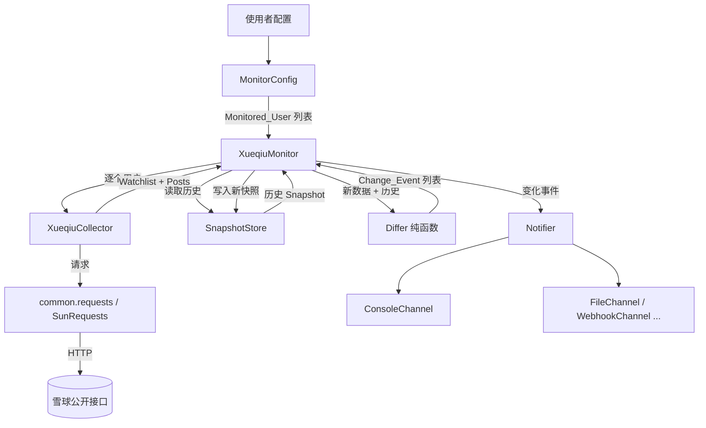
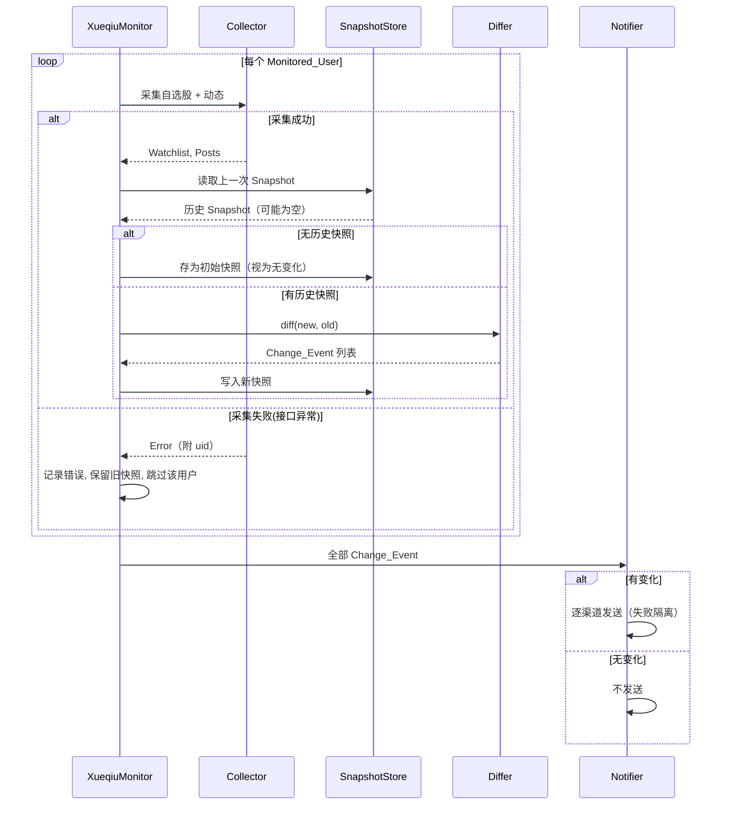

# 设计文档：雪球关注用户监听（xueqiu-user-monitor）

## Overview

本模块 `XueqiuMonitor` 为 adata 金融数据库项目新增「雪球关注用户监听」能力。它周期性地采集使用者指定的被监控用户在雪球（xueqiu.com）上的**自选股列表**与**发布动态**，将本次采集结果与上一次持久化的**快照（Snapshot）**进行比对，识别出「新增自选股」与「新发布动态」两类**变化事件（Change_Event）**，并在检测到变化时通过一个或多个**通知渠道（Notification_Channel）**推送给使用者。

设计遵循 adata 现有模块化约定：

- 复用 `adata.common.utils.sunrequests`（即 `adata.common.requests`）作为统一网络请求工具，自动获得重试、超时、代理与限流等待能力。
- 新增站点专属请求头 `adata/common/headers/xueqiu_headers.py`，与现有 `sina_headers`、`ths_headers` 保持一致风格。
- 采集结果使用 `pandas.DataFrame` 封装，与 `sentiment`、`fund`、`bond` 等模块输出风格一致。
- 采集（Collector）、比对（Differ）、持久化（SnapshotStore）、通知（Notifier）、调度（Monitor）职责分离，各自可独立测试。

核心设计目标是把「易出错的判定逻辑」（去重、代码标准化、快照往返、变化比对）设计成**纯函数**，从而可以用属性测试（PBT）大规模验证；而把「有副作用的部分」（网络采集、文件持久化、通知发送、周期调度）隔离出来，用示例测试与 mock 验证。

### 关键设计决策与理由

| 决策 | 理由 |
| --- | --- |
| 比对逻辑（Differ）设计为无副作用纯函数，输入「新数据 + 历史快照」输出 `Change_Event` 列表 | 变化检测是本功能最核心、最易出错的逻辑，纯函数便于用属性测试覆盖去重、集合差集、空快照等边界 |
| 快照采用本地 JSON 文件存储，按 `uid` 分文件 | 项目为本地运行的数据工具，无数据库依赖；JSON 便于往返序列化并满足需求 4.4 的一致性 |
| Collector 只负责「请求 + 解析成结构化数据」，不做比对与持久化 | 隔离 I/O 与业务逻辑，让解析失败、接口异常等错误在边界处被捕获（需求 9） |
| 股票代码标准化复用 `code_utils.compile_exchange_by_stock_code` 思路 | 满足需求 2.2「同一只股票在不同批次具有一致表示」，并与项目既有代码约定统一 |
| 通知渠道抽象为统一接口，默认控制台渠道 | 满足需求 7 的多渠道、失败隔离与默认渠道要求，便于扩展文件 / Webhook / IM 机器人 |

## Architecture

### 模块结构

新增 `adata/xueqiu/` 包，结构如下：

```
adata/
  xueqiu/
    __init__.py          # 聚合导出 XueqiuMonitor，暴露 xueqiu 实例
    config.py            # MonitorConfig：被监控用户名单管理、间隔、渠道、凭证
    collector.py         # XueqiuCollector：采集自选股与动态（含解析）
    snapshot.py          # SnapshotStore：快照持久化与读取（JSON 文件）
    differ.py            # 纯函数：diff_watchlist / diff_posts / normalize
    notifier.py          # Notifier + Notification_Channel 抽象与实现
    monitor.py           # XueqiuMonitor：编排采集→比对→通知，含周期调度
  common/headers/
    xueqiu_headers.py    # 雪球请求头（新增）
```

顶层 `adata/__init__.py` 增加 `from adata.xueqiu import xueqiu`，与 `sentiment`、`fund` 等保持一致的导入方式。

### 组件协作流程



### 一轮监听时序



### 周期调度

`XueqiuMonitor.start(interval_seconds)` 校验间隔为正整数后，进入循环：每轮完整执行「采集→比对→通知」，随后 `sleep(interval)`。间隔 ≤ 0 时立即返回「执行间隔非法」错误并终止启动（需求 8.3）。单个用户的采集异常被捕获、记录并跳过，不影响其余用户与后续轮次（需求 8.4 / 9.3）。

## Components and Interfaces

### MonitorConfig（config.py）

负责被监控用户名单的登记、去重与校验，以及间隔、渠道、凭证的集中管理。

```python
class MonitorConfig:
    def __init__(self, user_ids, interval_seconds=None,
                 channels=None, credential=None): ...

    @staticmethod
    def normalize_user_ids(user_ids: list[str]) -> tuple[list[str], list[str]]:
        """
        校验并去重用户 ID。
        返回 (valid_unique_ids, warnings)：
          - 非数字字符串的 ID 被跳过并生成一条「用户 ID 格式非法」警告
          - 重复 ID 去重后仅保留一个（保留首次出现顺序）
        """
```

- 需求 1.1：登记每个用户为 Monitored_User。
- 需求 1.2：名单为空时由 `XueqiuMonitor` 抛出/返回「监控名单为空」错误并终止。
- 需求 1.3：去重。
- 需求 1.4：非法 ID（非数字字符串）跳过并记录警告。

### XueqiuCollector（collector.py）

负责调用雪球接口并解析为结构化数据。仅做「请求 + 解析」，不做比对与持久化。

```python
class XueqiuCollector:
    def __init__(self, credential=None): ...

    def get_watchlist(self, uid: str) -> pd.DataFrame:
        """采集自选股，返回列 [stock_code, short_name]。
        - 非公开/不可访问 -> 抛 WatchlistNotAccessibleError
        - 接口非成功/超时 -> 抛 CollectRequestError(uid)
        - 响应无法解析 -> 抛 ResponseParseError(uid, raw)
        """

    def get_posts(self, uid: str) -> pd.DataFrame:
        """采集动态，返回列 [post_id, publish_time, content, source_url]，
        按 publish_time 从新到旧排序；缺少 post_id 的动态被跳过并记录警告。
        """
```

雪球接口（公开，均经 `adata.common.requests` 访问）：

- 自选股：`https://stock.xueqiu.com/v5/stock/portfolio/stock/list.json?size=1000&category=1&pid=-1&uid={uid}`
- 用户动态：`https://xueqiu.com/v4/statuses/user_timeline.json?user_id={uid}&page=1`

凭证处理（需求 2.4）：未提供有效 Credential 时，先匿名访问 `https://xueqiu.com` 获取会话 Cookie（如 `xq_a_token`、`u`），再携带该 Cookie 请求数据接口；提供了 Credential（Cookie）时优先使用。请求头集中在 `xueqiu_headers.py`。

- 需求 2.1 / 2.2 / 2.3 / 2.4：自选股采集、代码标准化、不可访问处理、匿名访问。
- 需求 3.1 / 3.2 / 3.3 / 3.4：动态采集、排序、空列表、缺标识跳过。
- 需求 9.1 / 9.2：接口失败与解析失败的错误封装。

### SnapshotStore（snapshot.py）

按 `uid` 将 Watchlist 与 Posts 持久化为本地 JSON 文件，并支持读取。

```python
class SnapshotStore:
    def __init__(self, base_dir: str = None): ...

    def save(self, uid: str, snapshot: Snapshot) -> None:
        """将快照序列化为 JSON 写入 {base_dir}/{uid}.json"""

    def load(self, uid: str) -> Snapshot | None:
        """读取最近一次快照；不存在返回 None"""
```

- 需求 4.1 / 4.2：保存与读取快照。
- 需求 4.3：无历史快照时存初始快照并视为无变化（由 Monitor 编排）。
- 需求 4.4：存储→读取往返一致（序列化/反序列化为纯函数，可属性测试）。
- 需求 9.3：采集失败时 Monitor 不调用 `save`，保留旧快照。

### Differ（differ.py，纯函数）

变化检测核心，无副作用。

```python
def normalize_stock_code(raw_code: str) -> str:
    """标准化股票代码，使同一只股票跨批次表示一致（需求 2.2）"""

def diff_watchlist(uid, new_wl, old_wl) -> list[ChangeEvent]:
    """返回「新增自选股」事件：在 new_wl 中但不在 old_wl 中的股票（按标准化代码判定）"""

def diff_posts(uid, new_posts, old_posts) -> list[ChangeEvent]:
    """返回「新发布动态」事件：post_id 在 new_posts 中但不在 old_posts 中的动态"""
```

- 需求 5.1–5.4：自选股新增检测（差集、无变化、删除不算新增、事件字段完整）。
- 需求 6.1–6.3：动态新增检测（按 post_id 差集、无新增不产生事件、事件字段完整）。

### Notifier（notifier.py）

```python
class NotificationChannel:  # 抽象
    def send(self, summary: str, events: list[ChangeEvent]) -> None: ...

class ConsoleChannel(NotificationChannel): ...
class FileChannel(NotificationChannel): ...
# 预留 WebhookChannel / IM 机器人渠道

class Notifier:
    def __init__(self, channels: list[NotificationChannel] = None): ...
    def notify(self, events: list[ChangeEvent]) -> None:
        """有事件时向每个渠道发送摘要；单渠道失败记录错误并继续其余渠道。"""
```

- 需求 7.1：有变化时发送包含全部事件摘要的通知。
- 需求 7.2：无变化时不发送。
- 需求 7.3：多渠道逐个发送。
- 需求 7.4：单渠道失败隔离，记录「通知发送失败」并继续。
- 需求 7.5：未配置渠道时默认使用 ConsoleChannel。

### XueqiuMonitor（monitor.py）

编排入口，聚合上述组件，并提供单轮执行与周期调度。

```python
class XueqiuMonitor:
    def __init__(self, config: MonitorConfig,
                 collector=None, store=None, notifier=None): ...

    def run_once(self) -> list[ChangeEvent]:
        """执行一轮：逐用户采集→比对→写快照，汇总事件后通知。"""

    def start(self, interval_seconds: int) -> None:
        """周期执行；interval<=0 返回「执行间隔非法」错误并终止启动。"""
```

- 需求 8.1 / 8.2 / 8.3 / 8.4：周期执行、逐用户处理、间隔校验、单用户错误隔离。

## Data Models

### Monitored_User

| 字段 | 类型 | 说明 |
| --- | --- | --- |
| uid | str | 雪球用户 ID（数字字符串），唯一标识 |

### Watchlist 项（DataFrame 行）

| 列名 | 类型 | 说明 |
| --- | --- | --- |
| stock_code | str | 标准化后的股票代码（如 `600297.SH`） |
| short_name | str | 股票名称 |

### Post（DataFrame 行）

| 列名 | 类型 | 说明 |
| --- | --- | --- |
| post_id | str | 动态唯一标识 |
| publish_time | str | 发布时间（`YYYY-MM-DD HH:MM:SS`） |
| content | str | 正文内容 |
| source_url | str | 来源链接 |

### Snapshot

```python
@dataclass
class Snapshot:
    uid: str
    watchlist: list[dict]   # [{stock_code, short_name}, ...]
    posts: list[dict]       # [{post_id, publish_time, content, source_url}, ...]
    collected_at: str       # 采集时间戳
```

序列化为 `{base_dir}/{uid}.json`。序列化/反序列化互为逆操作，满足往返一致（需求 4.4）。

### Change_Event

```python
@dataclass
class ChangeEvent:
    uid: str
    change_type: str        # "new_watchlist_stock" | "new_post"
    # 新增自选股（需求 5.4）
    stock_code: str | None = None
    short_name: str | None = None
    # 新发布动态（需求 6.3）
    post_id: str | None = None
    publish_time: str | None = None
    content: str | None = None
    source_url: str | None = None
```

## Correctness Properties

*属性（Property）是指在系统所有合法执行下都应当恒成立的特征或行为——本质上是关于「系统应当做什么」的形式化陈述。属性是人类可读规范与机器可验证正确性保证之间的桥梁。*

下述属性由验收标准转化而来。经过属性反思后，将若干逻辑上互相蕴含的标准合并为综合属性以消除冗余：需求 5.1/5.2/5.3/5.4 合并为「自选股差集属性」；需求 6.1/6.2/6.3 合并为「动态差集属性」；需求 7.1/7.3 合并为「多渠道分发属性」；需求 8.4/9.3 合并为「单用户错误隔离属性」；需求 1.1/1.3/1.4 合并为「名单归一化属性」。

### Property 1: 名单归一化（去重、校验、警告一致）

*对任意*由合法（数字字符串）与非法（非数字字符串）用户 ID 混合、且可含随机重复的名单，`normalize_user_ids` 的输出必须满足：只包含数字字符串、无重复、其集合等于输入中所有合法 ID 的集合，且被跳过的非法 ID 数量与生成的「用户 ID 格式非法」警告数量相等。

**Validates: Requirements 1.1, 1.3, 1.4**

### Property 2: 股票代码标准化确定且幂等

*对任意*原始股票代码字符串，`normalize_stock_code` 必须是确定性的（同一输入总得到同一输出），且幂等的（`normalize(normalize(x)) == normalize(x)`），从而保证同一只股票在不同采集批次中具有一致表示。

**Validates: Requirements 2.2**

### Property 3: 动态按发布时间从新到旧排序

*对任意*动态原始数据集合，经解析后得到的 Post 列表必须按 `publish_time` 非递增排列（相邻元素满足前者时间不早于后者）。

**Validates: Requirements 3.2**

### Property 4: 缺失标识的动态被跳过且警告一致

*对任意*含有部分缺失 `post_id` 的动态原始数据集合，解析输出必须只包含拥有 `post_id` 的动态，且被跳过（缺 `post_id`）的动态数量与生成的「动态缺少标识」警告数量相等。

**Validates: Requirements 3.4**

### Property 5: 快照存储读取往返一致

*对任意*合法 Snapshot，将其持久化后再读取（或序列化后再反序列化）得到的对象必须与原 Snapshot 等价。

**Validates: Requirements 4.4**

### Property 6: 自选股新增差集属性

*对任意*新采集 Watchlist 与历史 Snapshot 中的 Watchlist，`diff_watchlist` 产生的「新增自选股」事件集合必须恰好等于：按标准化股票代码判定，出现在新 Watchlist 中但不在历史 Watchlist 中的股票集合；因此当两者一致时不产生任何事件，且仅存在于历史而不在新列表中的股票不产生事件。每个事件必须包含 `uid`、`stock_code` 与 `short_name`。

**Validates: Requirements 5.1, 5.2, 5.3, 5.4**

### Property 7: 新发布动态差集属性

*对任意*新采集 Post 列表与历史 Snapshot 中的 Post 列表，`diff_posts` 产生的「新发布动态」事件集合必须恰好等于：`post_id` 出现在新列表中但不在历史列表中的动态集合；因此当新列表所有 `post_id` 均已存在于历史时不产生任何事件。每个事件必须包含 `uid`、`post_id`、`publish_time`、`content` 与 `source_url`。

**Validates: Requirements 6.1, 6.2, 6.3**

### Property 8: 多渠道全量分发属性

*对任意*非空 Change_Event 列表与任意数量（≥1）的通知渠道，`Notifier.notify` 必须使每个已配置渠道都恰好被调用一次，且每次调用收到的事件覆盖全部 Change_Event。

**Validates: Requirements 7.1, 7.3**

### Property 9: 通知渠道失败隔离属性

*对任意*渠道集合，若其中任意子集在发送时抛出异常，则所有未抛异常的渠道仍必须被调用，且每个失败均被记录为「通知发送失败」错误（一个渠道的失败不影响其余渠道的发送）。

**Validates: Requirements 7.4**

### Property 10: 单用户错误隔离与快照保留属性

*对任意*被监控用户集合，若其中任意子集在采集过程中抛出异常，则：所有未抛异常的用户仍必须被完整执行采集与比对；且对每个采集失败的用户，其快照不被更新（`SnapshotStore.save` 不被调用，保留上一次 Snapshot）。

**Validates: Requirements 8.4, 9.3**

## Error Handling

采用「在边界处封装、在编排层隔离」的策略。

### 错误类型（定义于 collector.py / 模块内）

| 异常 | 触发条件 | 承载信息 | 对应需求 |
| --- | --- | --- | --- |
| `EmptyWatchlistError` / 空名单错误 | 监控名单为空 | 提示「监控名单为空」 | 1.2 |
| `WatchlistNotAccessibleError` | 自选股非公开/不可访问 | uid | 2.3 |
| `CollectRequestError` | 请求非成功状态或超时 | uid | 9.1 |
| `ResponseParseError` | 响应无法解析为预期结构 | uid、原始响应 raw | 9.2 |
| `InvalidIntervalError` / 间隔非法 | 执行间隔 ≤ 0 | 提示「执行间隔非法」 | 8.3 |

### 处理策略

- **输入校验（快速失败）**：名单为空（1.2）与间隔非法（8.3）在启动前立即返回/抛错并终止，不进入监听循环。
- **非法用户 ID（容错继续）**：非数字 ID 在归一化阶段被跳过并记录警告（1.4），不影响其余用户。
- **单用户采集异常（隔离继续）**：`run_once` 对每个用户的采集包裹 try/except，捕获 `CollectRequestError` / `ResponseParseError` / `WatchlistNotAccessibleError`，通过 `adata` logger 记录错误后继续下一个用户；失败用户不写新快照，保留旧快照（8.4 / 9.3）。
- **动态缺标识（跳过记录）**：解析阶段跳过缺 `post_id` 的动态并记录警告（3.4）。
- **通知渠道失败（渠道级隔离）**：`Notifier.notify` 对每个渠道单独 try/except，失败记录「通知发送失败」并继续其余渠道（7.4）。
- **网络层**：底层由 `SunRequests` 提供重试、超时（默认 `(5, 20)`）与限流等待；Collector 只需根据最终响应状态/内容判定是否封装为上述错误。
- 日志统一使用 `logging.getLogger("adata")`，与项目现有约定一致。

## Testing Strategy

### 双重测试策略

- **单元 / 示例测试**：覆盖具体场景、边界与错误分支（prework 中分类为 EXAMPLE / EDGE_CASE / INTEGRATION 的标准）。
- **属性测试（PBT）**：覆盖上述 10 条 Correctness Properties，验证在大量随机输入下的通用正确性。

本功能核心判定逻辑（名单归一化、代码标准化、排序、快照往返、差集比对、通知分发与错误隔离）均为纯函数或可 mock 的编排逻辑，适合 PBT。网络采集与文件持久化的真实 I/O 用示例/集成测试覆盖。

### 属性测试要求

- 采用 Python 属性测试库 **Hypothesis**（不自行实现随机生成框架）。
- 每个属性测试**至少运行 100 次迭代**（`@settings(max_examples=100)` 或更高）。
- 每个属性测试以注释标注其对应的设计属性，格式：
  `# Feature: xueqiu-user-monitor, Property {number}: {property_text}`
- 每条 Correctness Property 用**单个**属性测试实现。

属性与测试对象映射：

| Property | 被测对象 | 生成器要点 |
| --- | --- | --- |
| 1 名单归一化 | `MonitorConfig.normalize_user_ids` | 合法数字串 + 非法串混合、含随机重复 |
| 2 代码标准化 | `normalize_stock_code` | 随机原始代码（含各交易所前缀、异常前缀） |
| 3 动态排序 | 动态解析函数 | 随机 `publish_time` 的动态集合 |
| 4 缺标识跳过 | 动态解析函数 | 部分随机缺 `post_id` 的原始动态 |
| 5 快照往返 | `SnapshotStore` 序列化/反序列化 | 随机 Snapshot（随机 watchlist/posts） |
| 6 自选股差集 | `diff_watchlist` | 随机新旧 Watchlist（含重叠、含仅旧有项） |
| 7 动态差集 | `diff_posts` | 随机新旧 Post 列表（按 post_id 重叠可控） |
| 8 多渠道分发 | `Notifier.notify` | 随机非空事件列表 + 随机渠道数（mock 渠道） |
| 9 渠道失败隔离 | `Notifier.notify` | 随机让部分 mock 渠道抛异常 |
| 10 单用户错误隔离 | `XueqiuMonitor.run_once` | 随机让部分 mock collector 抛异常 |

### 示例 / 集成 / 边界测试

| 标准 | 测试类型 | 要点 |
| --- | --- | --- |
| 1.2 空名单 | 示例 | 断言返回「监控名单为空」并终止 |
| 2.1 / 3.1 采集解析 | 集成 | 1-3 个代表性 mock 响应验证列/字段 |
| 2.3 不可访问 | 示例 | mock 响应，断言 `WatchlistNotAccessibleError` 并跳过比对 |
| 2.4 匿名访问 | 示例 | 无凭证时断言先获取匿名 Cookie 再请求数据接口 |
| 3.3 空动态 | 边界 | mock 空响应，断言返回空列表 |
| 4.1 / 4.2 / 4.3 快照存读 | 示例 | 保存/读取/无历史存初始且视为无变化 |
| 7.2 无变化不发送 | 示例 | 空事件时断言渠道未被调用 |
| 7.5 默认渠道 | 示例 | 未配置渠道时断言默认 `ConsoleChannel` |
| 8.1 / 8.2 周期执行 | 示例 | mock `sleep`/时间，验证按间隔触发与逐用户顺序 |
| 8.3 间隔非法 | 边界 | 传入 0 与负数，断言返回「执行间隔非法」且不进入循环 |
| 9.1 请求失败 | 示例 | mock 非成功/超时，断言 `CollectRequestError` 携带 uid |
| 9.2 解析失败 | 示例 | mock 非法响应，断言 `ResponseParseError` 保留 raw |

### 测试组织

测试置于项目测试目录（遵循现有约定，如 `tests/xueqiu/`），网络请求统一 mock，避免测试依赖真实雪球接口；仅保留少量可选的、默认跳过的真实集成测试用于人工验证接口可用性。
