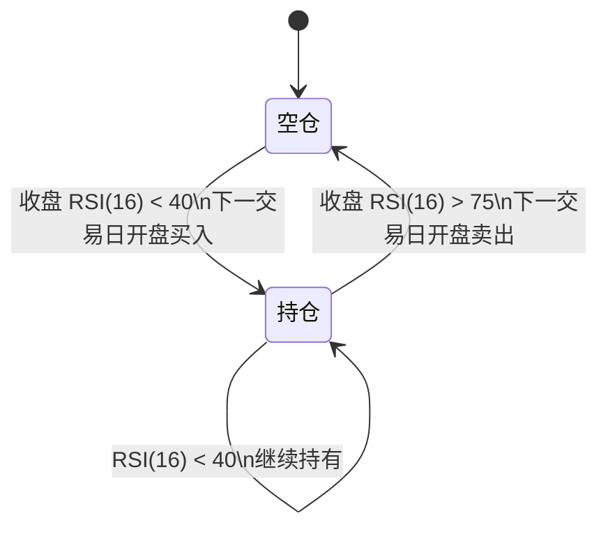

# 515450 日 K 技术走势反推策略

> 标的：南方标普中国 A 股大盘红利低波 50 ETF（515450）  
> 研究区间：2020-02-26 至 2026-08-11  
> 核心结论：515450 的历史走势更适合中周期 RSI 均值回归，不适合均线、MACD 或突破型趋势跟随。

## 1. 研究目标

本策略不从基金的行业、红利或基本面属性出发，而只观察上市以来的日 K 走势和技术指标，反向寻找更适合 515450 的交易方法。

研究关注三个问题：

1. 价格更偏趋势延续还是均值回归；
2. 哪类技术指标与其历史走势更匹配；
3. 参数在前后样本中是否具有一定稳定性，而不是只在全历史上碰巧最优。

## 2. 数据与回测口径

- 日线区间：2020-02-26 至 2026-08-11；
- 样本数量：1,568 个交易日；
- 使用现金分红复权后的总收益序列计算技术指标；
- 当日收盘后生成信号，下一交易日开盘成交；
- 单边交易成本按 0.03%估算；
- 只做多，不使用杠杆；
- 回测结果不代表未来收益。

### 为什么必须使用复权价格

515450 历史上有多次现金分红。除息日原始价格会自然下调，如果直接使用未复权收盘价计算 RSI、均线或回撤，可能把除息误判为真实下跌，产生错误的超卖信号。

因此，实盘计算应使用以下任意一种数据：

- 前复权日 K；
- 将现金分红计入并再投资的总收益价格序列。

## 3. 日 K 的主要统计特征

### 3.1 短线方向性不强

日收益在 1～10 个交易日尺度上的自相关很弱，说明单纯根据前一两天涨跌预测下一天，缺少稳定优势。

因此不适合：

- 根据单根阳线或阴线追涨杀跌；
- 高频使用 KDJ 金叉、MACD 金叉；
- 依赖连续上涨形成的短线突破信号。

### 3.2 中周期均值回归明显

将过去一段时间的涨幅从低到高分成五组，再观察相同长度的后续收益，得到以下结果：

| 观察周期 | 前期最弱组的后续平均收益 | 前期最强组的后续平均收益 |
|---|---:|---:|
| 20 个交易日 | 2.31% | 0.22% |
| 60 个交易日 | 5.55% | 2.25% |
| 120 个交易日 | 9.80% | 4.99% |

历史上，过去 20～120 日表现越弱的阶段，后续同周期平均收益反而越高；大涨后追入的后续赔率较低。

这表明 515450 的主要技术特征是：

> 短线噪声较多，中周期超卖后容易修复，均值回归强于趋势延续。

## 4. 技术策略横向比较

以下结果均采用前述复权与交易口径：

| 策略 | 年化收益 | 年化波动 | 最大回撤 |
|---|---:|---:|---:|
| 长期持有 | 11.2% | 14.5% | -14.5% |
| MA200 趋势择时 | 2.3% | 11.9% | -23.6% |
| MACD 金叉持有 | 4.8% | 11.0% | -18.6% |
| KDJ 金叉持有 | 3.7% | 10.5% | -16.0% |
| 唐奇安 60 日突破 | 3.2% | 10.0% | -12.5% |
| RSI(14)，40 买入/75 卖出 | 11.9% | 11.9% | -14.5% |
| RSI(16)，40 买入/75 卖出 | 14.2% | 12.5% | -14.5% |

趋势策略表现较弱的主要原因是：

- 均线和 MACD 往往等上涨已经发生后才入场；
- 震荡回落时容易反复止损；
- 跌破中长期均线并不一定意味着长期趋势反转，反而可能接近均值回归买点；
- 突破追涨容易买在阶段性过热区域。

## 5. 推荐策略：RSI 中周期均值回归

### 5.1 指标

在复权总收益日线上计算：

```text
Wilder RSI(16)
```

RSI 周期不应被理解为只能取 16。历史参数稳定区域大致为：

```text
RSI 周期：14～20
买入阈值：40～45
卖出阈值：75～80
```

为避免选取全历史单点最优参数，实盘采用稳定区域内相对保守的中间组合：

```text
RSI(16)，40 买入，75 卖出
```

### 5.2 买入规则

每日收盘后检查：

```text
当前空仓，并且 RSI(16) < 40
```

满足条件后，在下一交易日开盘买入。

不必等待 RSI 跌破 30。RSI 小于 30 的信号更极端，但出现次数很少，会错过一部分中等程度回撤后的修复行情。

### 5.3 持有规则

买入以后，在以下区域继续持有：

```text
40 ≤ RSI(16) ≤ 75
```

持仓期间：

- 不因跌破 20 日、60 日或 200 日均线卖出；
- 不因 MACD 死叉卖出；
- RSI 再次低于 40 时继续持有，不重复开仓；
- 不在中性区域频繁调整仓位。

### 5.4 卖出规则

每日收盘后检查：

```text
当前持仓，并且 RSI(16) > 75
```

满足条件后，在下一交易日开盘卖出。

如果希望尽可能多地保留强势行情，可以将卖出阈值放宽到 80；代价是回撤和持仓时间可能增加。

## 6. 策略状态机



这里采用的是带滞回区间的状态机，而不是每天把 RSI 直接映射成仓位。买入阈值和卖出阈值相距较远，可以减少指标在临界值附近震荡造成的反复交易。

## 7. 策略伪代码

```python
if position == 0 and rsi16 < 40:
    buy_at_next_open()

elif position == 1 and rsi16 > 75:
    sell_at_next_open()

else:
    hold()
```

严格回测时必须将信号至少延迟到下一根 K 线成交，不能使用当天收盘信号在当天收盘价成交。

## 8. 参数稳定性

将样本拆为：

- 前段：2020 年至 2023 年；
- 后段：2024 年至 2026 年 8 月。

较好的结果不是集中在某个孤立参数，而是集中在 RSI 14～20、买入阈值 40～45、卖出阈值 75～80 的邻域。

以 `RSI(16)，40/75` 为例：

- 前段年化收益约 12.3%；
- 后段年化收益约 12.6%；
- 使用下一交易日开盘成交的全区间年化收益约 14.2%；
- 年化波动约 12.5%；
- 最大回撤约 -14.5%；
- 平均持仓时间占比约 73%；
- 全区间只有十余次仓位切换。

需要注意：历史只有约六年半，完整买卖周期不多。参数邻域的稳定性比某个精确收益数字更值得参考。

## 9. 历史信号示例

采用 RSI(14) 的 40/75 规则作为相近参数示例，历史上出现过以下完整区间：

| 买入信号日 | 卖出信号日 | 信号日至信号日总收益 |
|---|---|---:|
| 2020-03-17 | 2020-07-06 | 10.58% |
| 2020-09-24 | 2020-11-27 | 9.22% |
| 2020-12-14 | 2021-09-03 | 16.13% |
| 2021-10-28 | 2023-03-03 | 10.90% |
| 2023-05-24 | 2024-02-19 | 12.32% |
| 2024-06-17 | 2024-09-26 | 5.57% |

表中收益用于展示历史信号结构，不等同于严格计入下一日开盘价及交易费用后的逐笔实盘收益。

## 10. 截至研究日的信号

截至 2026-08-11：

```text
收盘价：1.404
复权 RSI(16)：约 49.8
指标区域：40～75
```

按照状态机判断：

- 如果此前已经依据 RSI<40 买入：继续持有；
- 如果当前空仓：等待 RSI<40，不在中性区域追入；
- 下一个退出信号：持仓状态下 RSI>75。

策略状态依赖此前是否已经触发买入，不能仅凭当前 RSI 判断所有账户都应该持仓。

## 11. 风险与使用限制

1. **样本较短**：515450 上市时间有限，历史规律可能随市场结构变化而失效。
2. **最大回撤没有消失**：RSI 策略改善了历史收益波动比，但没有稳定降低最坏回撤。
3. **避免精确参数迷信**：不应因为历史上 `16/45/75` 收益更高，就认定它必然优于 `16/40/75`。
4. **必须复权**：原始价格会受到现金分红除息影响，直接计算 RSI 可能产生错误信号。
5. **避免未来函数**：收盘信号只能在下一交易日执行。
6. **考虑成交成本**：小资金频繁交易、佣金最低收费和买卖价差都会侵蚀收益。
7. **只适用于该历史样本**：不能直接把这套参数复制到其他 ETF。

## 12. 最终结论

从 515450 上市以来的日 K 和技术指标反推，它不是典型的趋势突破标的，而是具有明显中周期均值回归特征。

最匹配其历史走势的简化策略是：

> 使用复权日线计算 Wilder RSI(16)；空仓时 RSI 跌破 40，下一交易日开盘买入；持有期间忽略均线和 MACD 噪声；RSI 升破 75，下一交易日开盘卖出。

该结论的重点是“超卖进入、过热退出、低频持有”的结构，而不是精确到某一个 RSI 周期或阈值。

## 13. 数据参考

- [515450 历史现金分红记录](https://fundf10.eastmoney.com/fhsp_515450.html)
- [上交所基金产品资料概要](https://www.sse.com.cn/disclosure/fund/announcement/c/new/2024-12-11/515450_20241211_90C1.pdf)

