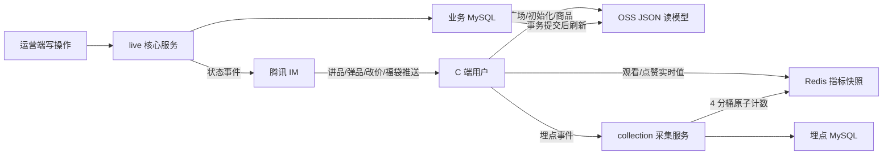

# Link Store Java 面试速记

> 对外项目名建议：**直播电商平台 / 超级商店直播中台**  
> 一句话定位：面向机构运营端和微信小程序，提供直播间、场次、商品、IM 互动、营销玩法、实时数据、播后复盘和商品回放的一体化后端系统。

## 一、30 秒版本

我最近主要负责一套直播电商平台的 Java 后端，业务覆盖小程序登录、直播间和场次管理、商品讲解、腾讯云直播与 IM、福袋、行为埋点、实时大盘、播后复盘，以及基于 HLS 的商品回放。系统按业务拆成 base、live、im、collection、data 等微服务，使用 Spring Boot、Spring Cloud、Nacos、OpenFeign、MySQL、Redis/Redisson、RocketMQ 和 SchedulerX。针对 C 端直播热点，我把稳定数据预计算到 OSS、把实时指标放在 Redis 并拆分热点计数、用 IM 推送状态变化；同时建设埋点采集、实时聚合和播后终态复盘的数据链路。

## 二、1 分钟自我介绍

我是一名 Java 后端开发，近期完整参与并主要落地了一套直播电商系统。这个系统一端连接机构运营后台和微信小程序，另一端对接腾讯云直播、腾讯云 IM、VOD、OSS 和内部交易系统。

在业务上，我负责过直播间和直播场次、商品上下架与讲解、福袋、用户关注、实时互动、行为采集、数据复盘和商品回放。在技术上，项目采用 Spring Boot/Spring Cloud 微服务体系，使用 Nacos 做注册和配置，OpenFeign 做服务调用，MySQL 和 MyBatis-Plus 做持久化，Redis/Redisson 做缓存、原子计数和分布式锁，RocketMQ 延时消息处理开奖兜底和播后数据计算，SchedulerX 承担在线人数、TS 采集和回放片段生成任务。

我认为最有代表性的三个点是：第一，围绕 C 端直播流量设计 OSS 静态化、Redis 热点拆分和 IM 实时推送，尽量不让高并发请求穿透到 MySQL；第二，设计从行为采集、实时指标到播后终态复盘的完整数据链路；第三，解析腾讯云 VOD 的 M3U8 和 TS 分片，按商品讲解区间生成可剪辑、可拼接、可投放的回放。

## 三、项目和模块怎么讲

### 1. `link-store-live`：直播核心域（主讲项目）

职责：

- 直播间、直播场次、推流地址、开播/下播和腾讯云回调。
- 商品搜索、添加、上下架、改价、排序、讲解、弹品和踢单。
- 福袋发送、开奖回调、延时兜底、中奖结果查询。
- 小程序端直播广场、初始化数据和商品列表的 OSS 刷新。
- 腾讯云 Live/VOD/IM、内部交易系统和旧小程序系统的集成。
- 整场回放、商品讲解片段、人工剪辑、预览、发布和取消发布。

技术点：

- 将直播广场、场次初始化、商品列表和商品直播状态预计算成 JSON 上传 OSS，使 C 端热点读不直接访问应用和数据库。
- 运营侧状态变化在事务提交后刷新 OSS 投影；开播、下播、讲品、弹品、改价和福袋等实时变化通过腾讯 IM 推送，减少客户端轮询。
- C 端观看数、点赞数等动态指标从 Redis 聚合快照读取，直播商品序号也放在 Redis Map，避免高频关系查询。
- `PLAN -> LIVE -> END` 以及 `PLAN -> CANCEL` 的场次状态约束。
- Redisson 分布式锁防止同一直播间并发开播；锁内只做必要校验和状态更新，缩短临界区。
- 开播前校验推流状态；下播时禁推、关闭未结束讲解片段并异步触发数据复盘。
- RocketMQ 延时消息：福袋开奖兜底、下播后立即和延迟两个阶段的数据计算。
- SchedulerX：在线人数采集、VOD TS 采集、讲解片段生成。
- 通过事务提交后的应用事件刷新直播初始化、直播广场和商品 OSS 数据，避免事务回滚时提前刷新缓存文件。
- FFmpeg 截取回放封面，显式配置有界线程池、超时、进程销毁和临时文件清理。

### 2. `link-store-collection`：行为采集和实时指标

职责：采集观看、点赞、在线人数、商品曝光、点击、加购、购买，以及回放观看/点击/购买等事件；接收腾讯 IM 回调；定时生成实时指标和最近下单消息。

设计：

- 根据事件粒度路由成三类：只计数、商品级明细、购买明细。
- 观看、点赞等实时计数使用 Redis `RAtomicLong`，按场次拆成 4 个随机分桶；查询时用 `RBatch` 批量读取并汇总。
- 定时将 Redis 指标聚合落库，同时保留商品和购买明细供复盘 SQL 聚合。
- 购买事件用 `businessCode` 作为业务幂等键，配合 Redisson 锁和数据库存在性判断防止重复写入。
- 最近订单任务读取直播商品序号缓存，组装 IM 自定义消息推送到直播间。
- IM 回调持久化失败时仍向腾讯返回成功，避免第三方反复重试拖垮主链路；异常会单独记录，便于告警和后续排查。

### 3. `link-store-data`：实时数据和播后复盘

职责：

- 实时大盘：在线人数、观看 PV/UV、GMV、GSV、订单件数、购买人数、曝光点击率、点击购买率。
- 商品维度：曝光、点击、加购、成交、GMV/GSV。
- 播后场次汇总、商品销售明细、分钟趋势、新增/累计粉丝。
- SKU 毛利：成本价、直播价、实付、退款、净销售、购物金、初始/实际毛利及毛利率。
- 报表导出和重新计算。

设计：

- 使用动态数据源跨 `third`（直播业务）、`second`（埋点）、`supermall`（交易）和 `base`（关注）读取数据。
- 实时接口采用 Redis + SQL 聚合：在线人数优先读缓存，缓存缺失回退数据库；复杂业务指标由 SQL 聚合。
- 商品列表先批量查出商品 ID，再分别批量聚合互动和购买指标，转成 Map 后内存关联，避免逐商品 N+1 查询。
- 下播后先基于埋点生成即时快照，再通过延时消息读取交易终态生成最终快照。
- 汇总结果按场次、商品、SKU 业务键 `saveOrUpdate`，保证消息重试时可重复执行。
- 所有金额使用 `BigDecimal`，比率统一精度和舍入规则，并处理零分母和空值。

### 4. `link-store-im`：腾讯云 IM 适配层

职责：账号导入、用户签名、资料设置、敏感词、群创建和修改、发消息、成员封禁/禁言、全员禁言、在线人数。

设计：

- 将腾讯 IM 的每个接口封装成 Request/Response 调用对象，共用请求上下文、签名、URL 构造、序列化和错误处理。
- Apache HttpClient 使用连接池，避免每次请求新建连接；ObjectMapper 复用并统一时间、未知字段配置。
- 自定义消息统一事件类型和数据体，支撑开播、下播、讲解、弹品、改价、福袋和关注等事件。
- 用户禁言使用用户粒度的 Redisson 锁，防止重复操作；本地记录与第三方调用放在程序化事务流程中。
- 对外提供单个/批量账号导入接口；调用侧 `base` 服务再完成去重、20 个一批、5ms 请求间隔限流以及成功/失败账号记录。

### 5. `link-store-base`：小程序接入和基础能力

职责：小程序客户端注册、登录、Token 刷新、用户资料同步、设备/IP 信息、直播间关注。

设计：

- 注册时建立 App、Client、User 关系并生成客户端密钥和 Token；游客态和登录态分别处理。
- 用户、客户端关系写入 Redis，设备信息通过独立线程池异步落库。
- IM 用户导入和资料更新异步执行，避免拖慢登录主链路。
- 批量导入包含去重、分批、限速、失败集合和手机号昵称脱敏。
- IP 定位使用责任链式组合解析：局域网、IP2Region、MaxMind，最后 Unknown 兜底。
- 直播间关注使用本地事务落库，关注变化通过 IM 通知直播间。

### 6. `link-store-replay`：复盘服务早期版本

这是直播复盘能力的早期独立实现，完成了场次汇总、商品销售和实时数据的第一版。后续能力演进到 `link-store-data`，增加了动态多数据源、分钟趋势、粉丝统计、SKU 毛利、延时终态计算和导出。面试时把它讲成“从原型到正式数据服务的演进”，不要描述成两个重复的线上服务。

## 四、最值得展开的三个难点

### 难点一：C 端直播高并发读写链路

直播 C 端的特点不是复杂单请求，而是热点高度集中：开播瞬间大量用户同时进入同一场次，反复读取相同的场次、商品和直播状态，同时持续产生观看、点赞、曝光、点击和购买事件。如果所有请求都经过 Java 服务查 MySQL，应用线程池、连接池和单场次热点行都会成为瓶颈。

我的处理可以概括为“静态读卸载、动态读缓存、实时变化推送、高频写拆热点”：

1. **静态读卸载**：提前把直播广场、场次初始化、商品列表和商品直播状态聚合成 JSON 上传 OSS。C 端读取对象存储，不让每次进入直播间都执行多表查询。
2. **动态读缓存**：观看、点赞等快速变化的数据不写入 OSS，而是从 Redis 的场次指标快照读取；商品 ID 到直播序号的映射也使用 Redis Map。
3. **实时变化推送**：开播、下播、开始讲品、弹品、改价、福袋等事件通过腾讯 IM 自定义消息推送，避免客户端高频轮询业务接口。
4. **实时计数拆热点**：观看和点赞在保存采集明细的同时，使用 Redisson `RAtomicLong` 把同一场次的实时累计值随机写入 4 个桶；聚合时再用 `RBatch` 一次读取全部桶求和，降低单 Redis Key 的竞争。
5. **事件分级存储**：只关心场次数量的事件写计数明细并更新 Redis；需要商品维度分析的曝光、点击、加购支持批量写明细；购买按业务单号幂等落库。
6. **读模型刷新**：运营端修改核心数据后，在事务提交之后刷新 OSS 读模型，避免数据库回滚但静态文件已经提前生效。
7. **应用层承压**：服务使用 Undertow，并通过 Nacos 注册发现保持实例无状态，具备横向扩容基础；真正的容量结论仍要结合实例数、连接池和压测数据。

这套设计本质上是 CQRS/物化视图思路：MySQL 保存权威写模型，OSS 和 Redis 承担面向 C 端的读模型，IM 承担变化通知。它接受秒级最终一致，换取热点期间源站和数据库的稳定性。

不要说“完全抗住多少万 QPS”，除非有压测或监控数据。可以说代码层面完成了热点读卸载、实时计数拆分和水平扩展设计，实际容量以线上监控为准。也要主动承认：当前观看/点赞仍同步保存采集明细，极端写流量下 MySQL 会先成为瓶颈；下一步应让客户端事件先进入 MQ，再由消费者批量写明细和流式聚合。

### 难点二：实时数据链路与播后终态复盘

数据链路：

1. C 端上报观看、点赞、在线时长、曝光、点击、加购、购买，以及回放观看/点击/购买等事件。
2. 采集服务按事件类型分流：计数事件写采集明细并更新 Redis 分桶，商品/用户维度事件写埋点明细，购买按 `businessCode` 幂等写入。
3. 定时任务扫描直播中场次，将 Redis 桶聚合成场次指标快照，供 C 端实时展示并阶段性落库。
4. 在线人数同时查询腾讯 IM 和云直播，按业务展示口径取有效最大值，写入 Redis 并保存分钟采样。
5. 数据服务跨直播库、埋点库、交易库和基础关注库聚合，形成场次、商品、分钟趋势、粉丝和 SKU 毛利结果。
6. 下播后立即使用埋点数据生成快速快照，延迟阶段再读取支付、退款等交易终态覆盖最终结果。
7. 汇总表使用业务唯一键 Upsert，因此消息重试或人工重算不会无限生成重复数据。

数据分层：

- **热数据层（Redis）**：分桶原子计数、在线人数、场次指标和商品序号，服务实时展示。
- **事实明细层（埋点 MySQL）**：保存用户、商品、场次和时间维度事件，支撑 UV、转化率和归因。
- **业务终态层（交易/直播/基础库）**：提供支付、退款、成本、商品、场次和关注关系等权威口径。
- **汇总查询层（复盘表）**：保存分钟、场次、商品和 SKU 快照，接口直接读汇总结果，避免每次跨库重算。

面试时应称为“实时数据链路、分层聚合和复盘体系”，不要直接称为 Flink/Hadoop 意义上的“大数据平台”。当前方案是 Redis + MySQL + RocketMQ + SchedulerX，适合现有规模且运维成本较低。如果数据量继续增长，可以演进为消息流统一入 Kafka/RocketMQ、Flink 做实时窗口聚合、ClickHouse/Doris 承担多维分析。

### 难点三：从直播流生成商品回放

完整链路：

1. SchedulerX 周期扫描直播中场次，从腾讯云 VOD 查找录制媒资。
2. 解析 master M3U8，按分辨率和带宽选择最高质量媒体列表。
3. 解析 `EXTINF`、`PROGRAM-DATE-TIME`、`KEY`、`MAP`、`DISCONTINUITY` 和媒体序号，保存 TS 元数据。
4. master/origin 两条录制流分别维护时间轴，按 `fileId/M3U8 URL` 去重，过滤实际开播前的试推片段。
5. 记录每个商品开始/结束讲解时间，按节目绝对时间或场次相对时间找到有交集的 TS。
6. 为讲解片段生成 M3U8，同时生成前后带 padding 的可编辑来源。
7. 人工调整片段后重新按 TS 边界裁剪，再按顺序合成商品最终 M3U8，并用 FFmpeg 截取封面。
8. 下播后等待录制归档完成，再生成带 `ENDLIST` 的终态整场回放；直播中按需生成 EVENT 快照，但不把快照误写成终态。

最容易被追问的坑：

- TS 只能稳定地按分片边界重组，不能像 MP4 一样任意毫秒精确裁剪。
- 跨源文件或分辨率变化时需要插入 `EXT-X-DISCONTINUITY`，让播放器重置解码器。
- 试推流可能没有完整视频头，因此要过滤实际开播前片段。
- 定时生成和用户按需生成可能并发，用 Redisson 锁并在获得锁后二次检查。
- 腾讯云录制文件有归档延迟，下播后不能立即认为文件完整。

## 五、面试官高频追问和回答

### 1. C 端直播高并发是怎么支撑的？

我没有让 C 端所有请求都走“Java 接口查 MySQL”。直播广场、场次初始化、商品列表和商品状态被预计算为 OSS JSON；观看、点赞和在线人数等动态指标走 Redis；开播、讲品、弹品、改价和福袋变化走腾讯 IM 推送；观看和点赞的实时累计值再拆成 4 个 Redis 原子计数桶。这样把大部分热点读卸载到对象存储，把动态读留在缓存，把变化通知改为推送，并降低单 Key 写竞争。Java 服务主要承接登录鉴权、控制操作、埋点和必要动态查询，可通过 Nacos 注册发现横向扩容。当前埋点明细仍同步写 MySQL，这是写链路继续 MQ 化和批量化的演进点。

### 2. 这能叫“大数据平台”吗，为什么没用 Flink/ClickHouse？

准确说它是实时数据链路和多源复盘体系，还不是 Hadoop/Flink 意义上的大数据平台。当前用 Redis 承接实时计数，MySQL 保存事实和汇总，RocketMQ 做延时触发，SchedulerX 做周期聚合，复杂度和现有规模匹配。没有为了技术栈而引入 Flink。如果埋点量增长到单库和定时聚合无法承担，可以把事件统一写消息流，Flink 做窗口、去重和维表关联，ClickHouse/Doris 承担明细及多维分析。

### 3. 为什么要拆成这些服务？

拆分依据是业务变化频率和资源模型，而不是单纯按表拆。直播核心域负责强状态流程；IM 是第三方能力适配层；采集服务面向高写入；数据服务面向跨库聚合和重查询；base 负责接入认证。这样可以独立发布、扩容和隔离故障，同时通过 client 模块发布 Feign 契约。代价是跨服务一致性和依赖版本管理更复杂，因此使用幂等、延时消息、状态回查和版本化 client 控制风险。

### 4. 为什么 Redis 计数后还要写 MySQL？

Redis 解决实时写入和低延迟读取，但不适合作为长期分析事实库。MySQL 保存明细和阶段性快照，支持 UV、时间范围、商品维度和财务口径聚合，也方便追溯。两者分别承担实时层和事实/汇总层。

### 5. 如何保证 MQ 不重复计算？

不假设消息只投递一次，而是让消费逻辑可重入。场次、商品、SKU 和分钟趋势汇总都按业务唯一键 Upsert；同一个 `sessionCode + timing` 重算会覆盖同一份结果。消费异常抛出触发重试。当前数据库提交与生产消息之间还不是原子操作，更完整的方案应使用本地消息表/Outbox，并增加消费记录、死信告警和人工补偿。

### 6. 分布式锁有什么风险？

需要关注锁粒度、等待时间、租期、异常释放和数据库兜底。开播锁按直播间而不是全局；用 `try/finally` 解锁；耗时第三方调用尽量不放锁内。回放按需生成设置等待和租期，并在加锁后重新查库。对于绝对不能重复的约束，仍应使用数据库唯一约束或乐观锁兜底。

### 7. 第三方接口成功、本地事务失败怎么办？

本地数据库事务不能回滚腾讯云或内部外部系统。当前通过调用顺序、幂等接口、状态回查和补偿降低风险，但严格来说仍是最终一致。进一步会采用本地消息表/Outbox：本地事务只写业务状态和待同步事件，提交后异步调用第三方，记录重试次数，超过阈值告警，并提供人工补偿入口。

### 8. IM 限流为什么是 5ms？

第三方上限是每秒 200 次，所以单机把相邻请求间隔控制为 5ms。使用 `AtomicLong + CAS` 预约下一个可用时间，竞争线程不会同时通过。它只解决单实例限流；多实例部署时应改成 Redis/Lua 或网关层分布式令牌桶，并为不同接口设置独立配额。

### 9. 如何避免 N+1 查询？

例如商品实时数据：先一次查出本场商品，再批量查询所有商品的互动和购买聚合，按商品 ID 转成 Map，最后在内存拼装响应，而不是循环逐商品查库。跨库结果也采用这种批量查询加内存关联方式。

### 10. 在线人数为什么取 IM 和云直播的最大值？

两个来源统计口径不同：IM 反映群在线，云直播反映流观看连接，任一来源都可能短暂缺失。业务希望避免单侧抖动导致在线人数突然下降，所以在都有效时取较大值，只有一侧有效时回退该侧；结果缓存 10 分钟并落分钟快照。需要说明这是业务展示口径，不是严格的去重在线 UV。

### 11. 如何处理金额和转化率？

金额一律用 `BigDecimal`，不使用 `double`；计算时明确 scale 和 `RoundingMode.HALF_UP`。比率统一区分存储精度和展示精度，处理 null 和零分母。GMV、GSV、实付、退款、毛利的业务口径要分别定义，避免只看字段名。

### 12. 项目还有哪些可以改进？

优先回答这些真实且有深度的点：

- 跨系统调用改成 Outbox + 补偿任务，避免长事务包住远程调用。
- 单机 IM 限流升级为分布式限流。
- 开播增加数据库唯一约束或乐观锁作为 Redisson 之外的兜底。
- 采集和数据计算补充统一幂等记录、死信告警和可观测性指标。
- 服务 client 依赖统一版本平台，减少手工升级和契约漂移。
- 对日志中的手机号、UnionId、Token 和第三方响应做统一脱敏。
- 增加 Testcontainers/集成测试，重点覆盖 Redis 锁、MQ 重试和多数据源 SQL。

## 六、STAR 项目亮点话术

### STAR 1：C 端高并发读写改造

- S：开播瞬间大量用户进入同一场次，集中读取相同的直播间、商品和状态，并持续产生观看、点赞、曝光和点击；如果全部查 MySQL，会形成应用和数据库热点。
- T：降低源站和数据库压力，同时保证讲品、弹品、改价等变化能及时到达客户端。
- A：把稳定读模型预计算成 OSS JSON；动态指标放 Redis；观看和点赞的实时累计值按场次随机拆成 4 个原子计数桶；使用 IM 自定义消息推送实时变化；事务提交后刷新 OSS 投影；定时用 RBatch 汇总桶并落库，同时保留埋点事实明细用于复盘。
- R：形成 OSS、Redis、IM、MySQL 分层的 C 端链路，将大部分热点读从业务服务剥离，并把单热点 Key 的写压力拆散。实际承载结果使用线上峰值 QPS、缓存命中率和数据库负载补充。

### STAR 2：福袋回调丢失兜底

- S：开奖依赖第三方回调，网络异常可能导致本地一直处于未开奖，用户查不到结果。
- T：既以第三方开奖结果为准，又要保证回调丢失后能收敛。
- A：发送福袋时投递开奖时间后的延时消息；消息触发后先查本地状态，再查询第三方终态；确认开奖后分页拉取中奖名单，写 Redis Map 并设置 24 小时 TTL；状态更新和 IM 推送都设计为重复执行可跳过。
- R：形成“正常回调 + 延时状态回查”的双通道，降低单点回调丢失对用户链路的影响。

### STAR 3：商品回放

- S：直播录制是多个 M3U8/TS，商品讲解时间与视频分片不天然对齐，且存在试推、清晰度变化和录制归档延迟。
- T：从直播录制中自动生成可预览、可编辑、可投放的商品回放。
- A：解析 VOD 媒资和 HLS 标签；建立场次统一时间轴；过滤试推 TS；按讲解时间映射分片；跨源和分辨率切换插入 discontinuity；生成编辑源、最终 M3U8 和 FFmpeg 封面；用定时任务和按需锁处理终态延迟及并发。
- R：把原本需要人工下载和剪辑的视频处理，转成围绕讲解时间自动生成并允许运营微调的在线流程。

## 七、简历项目描述（可直接改）

**直播电商平台｜Java 后端开发**

- 负责直播核心、IM、行为采集、数据复盘和小程序接入等微服务的设计与开发，覆盖直播场次、商品讲解、营销互动、实时指标和播后回放完整链路。
- 基于 Spring Boot、Nacos、OpenFeign 构建微服务，使用 MySQL/MyBatis-Plus、Redis/Redisson、RocketMQ 和 SchedulerX 支撑业务状态、实时计数、延时任务及跨服务协作。
- 面向 C 端直播热点构建分层读写链路：将场次初始化、直播广场和商品列表物化为 OSS JSON，以 Redis 承载动态指标并分桶拆分热点计数，通过腾讯 IM 推送实时状态变化，降低应用与 MySQL 压力。
- 设计高频行为采集和复盘链路，按计数、商品明细、购买明细分流，结合 Redis 实时聚合以及直播、埋点、交易、关注多数据源，生成场次、商品、分钟趋势和 SKU 毛利结果。
- 实现 HLS 回放处理：解析 master/media M3U8 与 TS 时间轴，处理多录制源、分辨率切换和 discontinuity，自动生成商品讲解片段、可编辑来源、最终回放及 FFmpeg 封面。
- 通过业务键幂等 Upsert、RocketMQ 延时回查和状态补偿处理播后数据及第三方系统的最终一致性；使用状态机和 Redisson 锁保护直播核心操作。
- 封装腾讯云 IM 适配层，支持账号、群组、消息、禁言和在线人数；实现批量导入去重、分批、限流、失败记录和用户信息脱敏。

## 八、面试前必须补的真实数字

不要编数字。出门前能确认多少填多少：

- 线上服务实例数：`____`
- 日活/直播场次数：`____`
- 峰值在线人数：`____`
- 埋点峰值 QPS / 日数据量：`____`
- 核心接口 P95/P99：`____`
- MySQL 最大表数据量：`____`
- Redis 数据规模：`____`
- 一场直播平均时长、TS 数量、回放生成耗时：`____`
- 线上最严重故障及恢复时间：`____`
- 你独立负责、协作负责的边界：`____`

如果面试官追问而你没有精确数字，可以回答：

> 我不想凭印象给一个不准确的峰值。架构上针对直播热点做了 OSS 静态读卸载、Redis 动态缓存和分桶计数、IM 推送以及服务横向扩容；准确 QPS、缓存命中率和实例负载需要以当时的监控报表为准。我可以先详细讲流量模型、容量设计和瓶颈位置。

## 九、最后 5 分钟只背这些

1. 项目一句话：直播电商中台，覆盖直播、IM、埋点、复盘和回放。
2. 核心栈：Spring Boot/Cloud、Nacos、Feign、MySQL、Redis/Redisson、RocketMQ、SchedulerX、腾讯云、OSS、FFmpeg。
3. C 端并发：OSS 静态读模型 + Redis 动态指标和 4 分桶计数 + IM 变化推送 + MySQL 权威写模型。
4. 数据：Redis 热数据层、埋点事实层、交易终态层、复盘汇总层；即时快照和延迟终态双阶段计算。
5. 一致性：业务键幂等 Upsert + MQ 重试 + 回调/延时回查 + Outbox 改进。
6. 回放：M3U8/TS 时间轴、讲解区间映射、discontinuity、终态延迟、按需生成锁。
7. 不虚构规模；把难点、取舍、缺陷和改进讲清楚。
